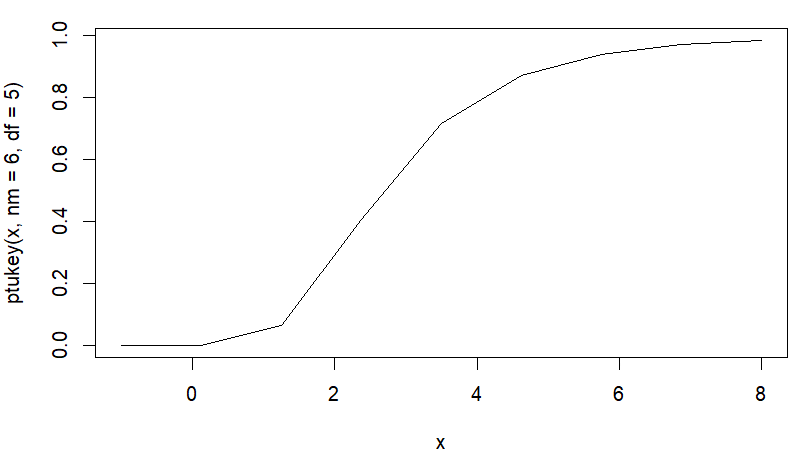

# libRmath.js

This R statistical [`nmath`][librmath.so] re-created in typescript/javascript.

If you were not using a previous version to 2.0.0, you can skip _breaking changes_ and go to:

- [Installation and usage](#installation-and-usage)
- [Table of contents](table-of-contents) 

## BREAKING CHANGES For version 2.0

### Removed

#### RNG (normal and uniform) are only selectable via `RNGkind` function.

The normal and uniform implementation of the various RNG's are not exported publicly anymore
Select normal and uniform RNG's via the function `RNGkind`.

```javascript
// this is NOT possible anymore
import { AhrensDieter } from 'lib-r-math.js';
const ad = new AhrensDieter();
ad.random();

// NEW way of doing things
import { RNGkind } from 'lib-r-math.js';
RNGkind({ normal: "AHRENS_DIETER" }); // R analog to "RNGkind"
rnorm(8); // get 8 samples, if you only want one sample consider rnormOne()  

```

#### helper functions for data mangling

Functions removed from 2.0.0 onwards: `any`, `arrayrify`, `multiplex`, `each`, `flatten`, `c`, `map`, `selector`, `seq`, `summary`.

It is recommended you either use well established js tools like [Rxjs](https://rxjs.dev) or [Ramdajs](https://ramdajs.com) to mangle arrays and data.

#### Removed helper functions for limiting numeric precision

Functions removed from 2.0.0 onwards: `numberPrecision`

This function mimicked the R's `options(digits=N)`.

### Changed

#### helper functions

Functions changed from 2.0.0 onwards: `timeseed`.

`timeseed` is now replaced by a cryptographic safe seed `seed`.

#### Sample distributions return a result of type `Float64Array`.

Functions changed from 2.0.0 onwards:

All these functions will return type of `Float64Array`:
`rbeta`, `rbinom`, `rcauchy`, `rchisq`, `rexp`, `rf`, `rgamma`, `rgeom`, `rhyper`, `rlogis`, `rlnorm`, `rmultinom`, `rnorm`, `rpois`, `rsignrank`, `rt`,`runif`, `rweibull`, `rwilcox`.

For single scalar (number) return values, use the analogs:
`rbetaOne`, `rbinomOne`, `rcauchyOne`, `rchisqOne`, `rexpOne`, `rfOne`, `rgammaOne`, `rgeomOne`, `rhyperOne`, `rlogisOne`, `rlnormOne`, `rnormOne`, `rpoisOne`, `rsignrankOne`, `rtOne`,`runifOne`, `rweibullOne`, `rwilcoxOne`.

Example:

```javascript
import { rbinom, rbinomOne, setSeed } from "lib-r-math.js";

rbinom(0); //
// -> FloatArray(0)

setSeed(123); // set.seed(123) in R
rbinom(2, 8, 0.5);
// -> Float64Array(2) [ 3, 5 ]  //same result as in R

setSeed(456); // set.seed(456) in R
rbinomOne(350, 0.5);
// -> 174  ( a single scalar )
```

### UMD module removed

There is no UMD module from 2.0.0. What module types are available for node and browser is listed [here]().

## Installation and usage

```bash
npm i lib-r-math.js
```

lib-r-math.js supports the following module types:

### ESM for use in [observablehq](www.observablehq.com)

```javascript
library = import("https://cdn/skypack.dev/lib-r-math.js/dist/web.esm.mjs");

library.BesselJ(3, 0.4);
//-> -0.30192051329163955
```

### ESM for use as Browser client

```html
<script type="module">
  import { BesselJ } from "https://unpkg.dev/lib-r-math.js@2.0.0-rc7/dist/web.esm.mjs";

  console.log(BesselJ(3, 0.4));
  //-> -0.30192051329163955
</script>
```

### IIFE for use in Browser client

```html
<script src="https://unpkg.dev/lib-r-math.js@2.0.0-rc7/dist/web.iife.js"></script>
<script>
  const answ = window.R.BesselJ(3, 0.4);
  console.log(answ);
  //-> -0.30192051329163955
</script>
```

### ESM for Node

```javascript

import { BesselJ } from 'lib-r-math.js';

const answ = BesselJ(3, 0.4);
//-> -0.30192051329163955
```

### COMMONJS for node

```javascript
const { BesselJ } = require('lib-r-math.js');

const answ = BesselJ(3, 0.4);
//-> -0.30192051329163955
```

## Table of Contents

- [libRmath.js](#librmathjs)
  - [BREAKING CHANGES For version 2.0](#breaking-changes-for-version-20)
    - [Removed](#removed)
      - [RNG (normal and uniform) are only selectable via `RNGkind` function.](#rng-normal-and-uniform-are-only-selectable-via-rngkind-function)
      - [helper functions for data mangling](#helper-functions-for-data-mangling)
      - [Removed helper functions for limiting numeric precision](#removed-helper-functions-for-limiting-numeric-precision)
    - [Changed](#changed)
      - [helper functions](#helper-functions)
      - [Sample distributions return a result of type `Float64Array`.](#sample-distributions-return-a-result-of-type-float64array)
    - [UMD module removed](#umd-module-removed)
  - [Installation and usage](#installation-and-usage)
    - [ESM for use in observablehq](#esm-for-use-in-observablehq)
    - [ESM for use as Browser client](#esm-for-use-as-browser-client)
    - [IIFE for use in Browser client](#iife-for-use-in-browser-client)
    - [ESM for Node](#esm-for-node)
    - [COMMONJS for node](#commonjs-for-node)
  - [Table of Contents](#table-of-contents)
  - [Auxiliary functions](#auxiliary-functions)
    - [`RNGkind`](#rngkind)
    - [`setSeed`](#setseed)
    - [`randomSeed`](#randomseed)
  - [Distributions](#distributions)
    - [The Beta distribution](#the-beta-distribution)
    - [The Binomial distribution](#the-binomial-distribution)
    - [The Negative Binomial Distribution](#the-negative-binomial-distribution)
    - [The Cauchy Distribution](#the-cauchy-distribution)
    - [The Chi-Squared (non-central) Distribution](#the-chi-squared-non-central-distribution)
    - [The Exponential Distribution](#the-exponential-distribution)
    - [The F Distribution](#the-f-distribution)
    - [The Gamma Distribution](#the-gamma-distribution)
    - [The Geometric Distribution](#the-geometric-distribution)
    - [The Hypergeometric Distribution (Web Assembly accalerated)](#the-hypergeometric-distribution-web-assembly-accalerated)
      - [Web Assembly backend](#web-assembly-backend)
    - [The Logistic Distribution](#the-logistic-distribution)
    - [The Log Normal Distribution](#the-log-normal-distribution)
    - [The Multinomial Distribution](#the-multinomial-distribution)
    - [The Normal Distribution](#the-normal-distribution)
    - [The Poisson distribution](#the-poisson-distribution)
    - [Distribution of the Wilcoxon Signed Rank Statistic](#distribution-of-the-wilcoxon-signed-rank-statistic)
      - [Web Assembly backend](#web-assembly-backend-1)
    - [The Student t Distribution](#the-student-t-distribution)
    - [The Studentized Range Distribution](#the-studentized-range-distribution)
    - [The Uniform Distribution](#the-uniform-distribution)
    - [The Weibull Distribution](#the-weibull-distribution)
    - [Distribution of the Wilcoxon Rank Sum Statistic](#distribution-of-the-wilcoxon-rank-sum-statistic)
- [END OF OLD DOC](#end-of-old-doc)
  - [Special Functions of Mathematics](#special-functions-of-mathematics)
    - [Bessel functions](#bessel-functions)
      - [`besselJ`](#besselj)
      - [`besselY`](#bessely)
      - [`besselI`](#besseli)
      - [`besselK`](#besselk)
    - [Beta functions](#beta-functions)
      - [`beta`](#beta)
      - [`lbeta`](#lbeta)
    - [Gamma functions](#gamma-functions)
      - [`digamma`](#digamma)
      - [`trigamma`](#trigamma)
      - [`tetragamma`](#tetragamma)
      - [`pentagamma`](#pentagamma)
      - [`psigamma`](#psigamma)
      - [`gammma`](#gammma)
      - [`lgammma`](#lgammma)
    - [Binomial coefficient functions](#binomial-coefficient-functions)
      - [`choose`](#choose)
      - [`lchoose`](#lchoose)

## Auxiliary functions

### `RNGkind`

RNGkind is the analog to R's "RNGkind". This is how you select what RNG (normal and uniform) you use and the samplingKind

Follows closely the R implementation [here](https://stat.ethz.ch/R-manual/R-devel/library/base/html/Random.html)

R console:

```R
> RNGkind()
[1] "Mersenne-Twister" "Ahrens-Dieter"   
[3] "Rejection"   
```

Just like in _R_, calling `RNGkind` with no argument returns the currently active RNG's (uniform and normal) and sample kind (Rounding or Rejection)

Like in _R_, `RNGkind` optionally takes an argument of type `RandomGenSet`, after processing it will return the (adjusted) `RandomGenSet` indicating what RNG's and "kind of sampling" is being used.

Rjs _typescript decl_:

```typescript
function RNGkind (options?: RandomGenSet): RandomGenSet;
```

Arguments:
- `options`: an object of type `RandomGenSet`
  - `options.uniform`: string, specify name of uniform RNG to use.
  - `options.normal`: string, specify nam of normal RNG (shaper) to use
  - `options.sampleKind`: string, specify sample strategy to use

Typescript definition:
```typescript
type RandomGenSet = {
    uniform?: 'KNUTH_TAOCP'| 'KNUTH_TAOCP2002'|'LECUYER_CMRG'| 'MARSAGLIA_MULTICARRY'|'MERSENNE_TWISTER'|'SUPER_DUPER'|'WICHMANN_HILL'
    normal?:'AHRENS_DIETER'|'BOX_MULLER'|'BUGGY_KINDERMAN_RAMAGE'|'KINDERMAN_RAMAGE'|'INVERSION'
    sampleKind?: 'ROUNDING'|'REJECTION'
};
```

The `RNGkind` function is decorated with the following extra properties:

| property             | description                        | example                                                                                |
| -------------------- | ---------------------------------- | -------------------------------------------------------------------------------------- |
| `RNGkind.uniform`    | list of constants of uniform RNG's | `RNGkind.uniform.MARSAGLIA_MULTICARRY` is equal to the string `"MARSAGLIA_MULTICARRY"` |
| `RNGkind.normal`     | list of constants of normal RNG's  | `RNGkind.normal.KINDERMAN_RAMAGE` is equal to the string `"KINDERMAN_RAMAGE"`          |
| `RNGkind.sampleKind` | list of sampling strategies        | `RNGkind.sampleKind.ROUNDING` is equal to the string `"ROUNDING"`                      |

Example: set uniform RNG to `SUPER_DUPER` and normal RNG to `BOX_MULLER`

```typescript
import { RNGkind } from 'lib-r-math.js'

const uniform = RNGkind.uniform.SUPER_DUPER;
const normal = RNGkind.normal.BOX_MULLER;

RNGkind({ uniform, normal }); //-> "sampleKind" not specified so this will not be changed

RNGkind(); // no arguments, will return the current used RNG's and "sampleKind"
// returns 
//  {
//    uniform: 'SUPER_DUPER',
//    normal: 'BOX_MULLER',
//    sampleKind: 'ROUNDING'  // was not changed from default setting
//  }
```

### `setSeed`

Uses a single value to initialize the internal state of the currently selected uniform RNG.

R console analog: `set.seed`

Rjs _typescript decl_

```typescript
function setSeed(s: number): void;
```

Arguments:
- `s` is coerced to an unsigned 32 bit integer 

### `randomSeed`

R console analog: `.Random.seed`

Rjs _typescript decl_

```typescript
function randomSeed(internalState?: Uint32Array | Int32Array): Uint32Array | Int32Array | never;
```

Arguments:
  - (optional) `internalState`: the value of a previously saved RNG state, the current RNG state will be set to this.
  - return state of the current selected RNG 

Exceptions:
  - If the `internalState` value is not correct for the RNG selected an Error will be thrown.


## Distributions

All distribution functions follow a prefix pattern:

- `d` (like `dbeta`, `dgamma`) are desnisty functions
- `p` (like `pbeta`, `pgamma`) are (cummulative) distribution function
- `q` (like `qbeta`, `qgamma`) are quantile functions
- `r` (like `rbeta/rbetaOne`, `rgamma/rgammaOne`) generates random deviates 

### The Beta distribution

| type                     | function spec                                                                                                     |
| ------------------------ | ----------------------------------------------------------------------------------------------------------------- |
| density function         | `function dbeta(x: number, shape1: number, shape2: number, ncp?: number, log = false): number`                    |
| distribution function    | `function pbeta(q: number, shape1: number, shape2: number, ncp?: number, lowerTail = true, logP = false): number` |
| quantile function        | `function qbeta(p: number, shape1: number, shape2: number, ncp?: number, lowerTail = true, logP = false): number` |
| random generation (bulk) | `function rbeta(n: number, shape1: number, shape2: number, ncp?: number): Float32Array`                           |
| random generation        | `function rbetaOne(shape1: number, shape2: number): number`                                                       |

- Arguments:
  - `x, q`: quantile value
  - `p`: probability
  - `n`: number of observations
  - `shape1, shape2`: Shape parameters of the Beta distribution
  - `log, logP`: if `true`, probabilities are given as `log(p)`.
  - `lowerTail`: if `true`, probabilities are `P[X ≤ x]`, otherwise, `P[X > x]`.


Example:

```javascript
import { dbeta } from 'lib-r-math.js';

dbeta(0.5, 2, 2);
// -> 1.5
```

### The Binomial distribution

| type                     | function spec                                                                                     |
| ------------------------ | ------------------------------------------------------------------------------------------------- |
| density function         | `function dbinom(x: number, n: number, prob: number, log = false): number`                        |
| distribution function    | `function pbinom(q: number, n: number, prob: number, lowerTail = true, logP = false): number`     |
| quantile function        | `function qbinom(p: number, size: number, prob: number, lower_tail = true, logP = false): number` |
| random generation (bulk) | `function rbinom(n: number, size: number, prob: number): Float64Array`                            |
| random generation        | `function rbinomOne(size: number, prob: number): number`                                          |

- Arguments:
  - `x, q`: quantile value
  - `p`: probability
  - `n`: number of observations.
  - `size`: number of trials (zero or more).
  - `prob`: probability of success on each trial.
  - `log, logP`: if `true`, probabilities are given as `log(p)`.
  - `lowerTail`: if `true`, probabilities are `P[X ≤ x]`, otherwise, `P[X > x]`.

Example:

```javascript
import { dbinom } from 'lib-r-math.js';

dbinom(50, 100, 0.5);
// -> 0.07958924
```

### The Negative Binomial Distribution

| type                     | function spec                                                                                                   |
| ------------------------ | --------------------------------------------------------------------------------------------------------------- |
| density function         | `function dnbinom(x: number, size: number, prob?: number, mu?: number, log = false): number`                    |
| distribution function    | `function pnbinom(q: number, size: number, prob?: number, mu?: number, lowerTail = true, logP = false): number` |
| quantile function        | `function qnbinom(p: number, size: number, prob?: number, mu?: number, lowerTail = true, logP = false): number` |
| random generation (bulk) | `function rnbinom(n: number, size: number, prob?: number, mu?: number): Float64Array`                           |
| random generation        | `function rnbinom(size: number, prob?: number, mu?: number): number`                                            |

Arguments:
- `x, q`: quantile value.
- `p`: probability.
- `n`: number of observations.
- `size`: target for number of successful trials, (need not be integer) or dispersion parameter (the shape parameter of the gamma mixing distribution). Must be strictly positive.
- `prob`: probability of success in each trial. `0 < prob <= 1`.
- `mu`: alternative parametrization via mean: see ‘Details’.
- `log, logP`: if `true`, probabilities are given as `log(p)`.
- `lowerTail`: if `true`, probabilities are `P[X ≤ x]`, otherwise, `P[X > x]`.

Details: (from R [doc](https://stat.ethz.ch/R-manual/R-devel/library/stats/html/NegBinomial.html))

A negative binomial distribution can also arise as a mixture of Poisson distributions with mean distributed as a gamma distribution (see pgamma) with scale parameter (1 - prob)/prob and shape parameter size. (This definition allows non-integer values of size.)

An **alternative parametrization** (often used in ecology) is by the mean `mu` (see above), and size, the dispersion parameter, where `prob = size/(size+mu)`. The variance is `mu + mu^2/size` in this parametrization.

Example:

R console:

 ```R
 > options(digits=22)
> 126 /  dnbinom(0:8, size  = 2, prob  = 1/2)
[1]   504.0000000000000000000   503.9999999999998863132   672.0000000000000000000  1008.0000000000001136868
[5]  1612.7999999999994997779  2688.0000000000013642421  4607.9999999999972715159  8064.0000000000000000000
[9] 14336.0000000000145519152
```

Equivalence in js (fidelity):

```typescript
import { dnbinom } from 'lib-r-math.js';

console.log(  
  [0, 1, 2, 3, 4, 5, 6, 7, 8].map( x => 126/dnbinom(x , 2, 0.5))
);
// ->
[ 504, 503.9999999999999, 672, 1008.0000000000001, 1612.7999999999988, 2688.0000000000014, 4607.999999999997, 8064, 14336.000000000015 ]
```

### The Cauchy Distribution

| type                     | function spec                                                                                  |
| ------------------------ | ---------------------------------------------------------------------------------------------- |
| density function         | `function dcauchy(x: number, location = 0, scale = 1, log = false): number`                    |
| distribution function    | `function pcauchy(x: number, location = 0, scale = 1, lowerTail = true, logP = false): number` |
| quantile function        | `function qcauchy(p: number, location = 0, scale = 1, lowerTail = true, logP = false): number` |
| random generation (bulk) | `function rcauchy(n: number, location = 0, scale = 1): Float32Array`                           |
| random generation        | `function rcauchyOne(location = 0, scale = 1): number`                                         |

Arguments:
- `x, q`: quantile value.
- `p`: probability.
- `n`: number of observations.
- `location, scale`: location and scale parameters.
- `log, logP`: if `true`, probabilities are given as `log(p)`.
- `lowerTail`: if `true`, probabilities are `P[X ≤ x]`, otherwise, `P[X > x]`.

Examples

R console:
```R
dcauchy(-1:4)
[1] 0.15915494309189534560822 0.31830988618379069121644 0.15915494309189534560822 0.06366197723675813546773
[5] 0.03183098861837906773387 0.01872411095198768526959
```

Equivalence in js (fidelity):
```typescript
import { dcauchy } from 'lib-r-math.js';

console.log(  [-1,0,1,2,3,4].map(x => dcauchy(x))  );
// -> [  0.15915494309189535, 0.3183098861837907, 0.15915494309189535, 0.06366197723675814, 0.03183098861837907, 0.018724110951987685 ]
```

### The Chi-Squared (non-central) Distribution

| type                     | function spec                                                                                   |
| ------------------------ | ----------------------------------------------------------------------------------------------- |
| density function         | `function dchisq(x: number, df: number, ncp?: number, log = false ): number`                    |
| distribution function    | `function pchisq(p: number, df: number, ncp?: number, lowerTail = true, logP = false ): number` |
| quantile function        | `function qchisq(p: number, df: number, ncp?: number, lowerTail = true, logP = false ): number` |
| random generation (bulk) | `function rchisq(n: number, df: number, ncp?: number): Float64Array`                            |
| random generation        | `function rchisqOne(df: number, ncp?: number): number `                                         |


Arguments:
- `x, q`: quantile.
- `p`: probability.
- `n`: number of observations.
- `df`: degrees of freedom (non-negative, but can be non-integer).
- `ncp`: non-centrality parameter (non-negative).
- `log, logP`: if `true`, probabily p are given as log(p).
- `lowerTail`: if true`TRUE (default), probabilities are P[X \le x]P[X≤x], otherwise, P[X > x]P[X>x].

Examples

R console:
```R
dchisq(1, df = 1:3)
[1] 0.2419707 0.3032653 0.2419707
```

Equivalence in js (fidelity):
```typescript
import { dchisq } from 'lib-r-math.js';

console.log(   [1,2,3].map( df => dchisq(1, df))  );
// -> [ 0.24197072451914337, 0.3032653298563167, 0.24197072451914337 ]
```

### The Exponential Distribution

| type                     | function spec                                                                |
| ------------------------ | ---------------------------------------------------------------------------- |
| density function         | `function dexp(x: number, rate = 1, log = false): number`                    |
| distribution function    | `function pexp(q: number, rate = 1, lowerTail = true, logP = false): number` |
| quantile function        | `function qexp(p: number, rate = 1, lowerTail = true, logP = false): number` |
| random generation (bulk) | `function rexp(n: number, rate = 1):Float64Array`                            |
| random generation        | `function rexpOne(rate = 1): number `                                        |

Arguments:
- `x, q`: quantile.
- `p`: probabily.
- `n`: number of observations.
- `rate`: the exp rate parameter
- `log, logP`: if `true`, probabilities `p` are given as `log(p)`.
- `lower.tail`: if `true` (default), probabilities are P[ X ≤ x ], otherwise, P[X > x].

Examples

R console:

```R
dexp(1) - exp(-1)
[1] 0
```

Equivalence in js (fidelity):
```typescript
import { dexp } from 'lib-r-math.js';

console.log( dexp(1) - Math.exp(-1)  );
// -> 0
```

### The F Distribution

| type                     | function spec                                                                                            |
| ------------------------ | -------------------------------------------------------------------------------------------------------- |
| density function         | `function df(x: number, df1: number, df2: number, ncp?: number, log = false): number`                    |
| distribution function    | `function pf(q: number, df1: number, df2: number, ncp?: number, lowerTail = true, logP = false): number` |
| quantile function        | `function qf(p: number, df1: number, df2: number, ncp?: number, lowerTail = true, logP = false): number` |
| random generation (bulk) | `function rf(n: number, df1: number, df2: number, ncp?: number): Float64Array`                           |
| random generation        | `function rfOne(df1: number, df2: number, ncp?: number): number`                                         |

Arguments:
- `x, q`: quantile.
- `p`: probabily.
- `n`: number of observations.
- `df1, df1`: degrees of freedom. `Infinity` is allowed.
- `ncp`: non-centrality parameter. If omitted the central F is assumed.
- `log, logP`: if `true`, probabilities `p` are given as `log(p)`.
- `lowerTail`: if `true` (default), probabilities are `P[ X ≤ x ]`, otherwise, `P[X > x]`S.

**NOTE: JS has no named arguments for functions, so specify ncp = undefined, if you want to change the `log, logP, lowerTail` away from their defaults

Examples

R console:
```R
## Identity (F <-> Beta <-> incompl.beta):
n1 <- 7 ; n2 <- 12; qF <- c((0:4)/4, 1.5, 2:16)
x <- n2/(n2 + n1*qF)
stopifnot(all.equal(pf(qF, n1, n2, lower.tail=FALSE),
                    pbeta(x, n2/2, n1/2)))
```

Equivalence in js (fidelity):
```typescript
import { pf, pbeta } from "lib-r-math.js";

var qF = [
  0.0, 0.25, 0.5, 0.75, 1.0, 1.5, 2.0, 3.0, 4.0, 5.0, 6.0, 7.0, 8.0, 9.0, 10.0,
  11.0, 12.0, 13.0, 14.0, 15.0, 16.0,
];

var n1 = 7;
var n2 = 12;
var xs = qF.map((qf) => n2 / (n2 + n1 * qf));

var betas = xs.map((x) => pbeta(x, n2 / 2, n1 / 2));

var fisher = qF.map((qf) => pf(qf, n1, n2, undefined /*no ncp*/, false));

// array "betas" and "fisher" should be equal

console.log(fisher.map((f,i) => f - betas[i]));
//-> [ 0, 0, 0, 0, 0, ...., 0]
```

### The Gamma Distribution

| type                     | function spec                                                                                                      |
| ------------------------ | ------------------------------------------------------------------------------------------------------------------ |
| density function         | `function dgamma(x: number, shape: number, rate?: number, scale?: number, log = false): number`                    |
| distribution function    | `function pgamma(q: number, shape: number, rate?: number, scale?: number, lowerTail = true, logP = false): number` |
| quantile function        | `function qgamma(p: number, shape: number, rate?: number, scale?: number, lowerTail = true, logP = false): number` |
| random generation (bulk) | `function rgamma(n: number, shape: number, rate?: number, scale?: number): Float64Array`                           |
| random generation        | `function rgammaOne(shape: number, rate?: number, scale?: number): number`                                         |


Arguments:
- `x, q`: quantile
- `p`: probability
- `n`: number of observations.
- `rate`: an alternative way to specify the scale.
- `shape, scale`: shape and scale parameters. Must be positive, scale strictly.
- `log, logP`: if `true`, probabilities/densities `p` are returned as `log(p)`.
- `lowerTail`: if `true` (default), probabilities are `P[ X ≤ x]`, otherwise, `P[X > x]`.

Example:

R console:
```R
-log(dgamma(1:4, shape = 1))
[1] 1 2 3 4
```

Equivalence in js (fidelity):
```typescript
import { dgamma } from "lib-r-math.js";

let dg = [1,2,3,4].map( x => Math.log( dgamma(x, 1) ));
// -> [ -1, -2, -3, -4 ]
//
// this is Equivalence to to 
// [1,2,3,4].map (x => dgamma(x, 1, undefined, undefined, true) );
```

### The Geometric Distribution

| type                     | function spec                                                                      |
| ------------------------ | ---------------------------------------------------------------------------------- |
| density function         | `function dgeom(x: number, p: number, log = false): number`                        |
| distribution function    | `function qgeom(p: number, prob: number, lowerTail = true, logP = false): number ` |
| quantile function        | `function qgeom(p: number, prob: number, lowerTail = true, logP = false): number`  |
| random generation (bulk) | `function rgeom(n: number, prob: number): Float64Array`                            |
| random generation        | `function rgeomOne(p: number): number`                                             |

Arguments:
- `x, q`: quantile
- `p`: probability
- `n`: number of observations.
- `prob`: probability of success in each trial. 0 < prob <= 1.
- `log, logP`: if `true`, probabilities/densities `p` are returned as `log(p)`.
- `lowerTail`: if `true` (default), probabilities are `P[ X ≤ x]`, otherwise, `P[X > x]`.

Example:

R console:
```R
qgeom((1:9)/10, prob = .2)
[1]  0  0  1  2  3  4  5  7 10
```

Equivalence in js (fidelity):
```typescript
import { qgeom } from "lib-r-math.js";

let dg = [1, 2, 3, 4, 5, 6, 7, 8, 9]
  .map((p) => p / 10)
  .map((p) => qgeom(p, 0.2));

console.log(dg);
// -> [ 0, 0, 1,  2, 3, 4, 5, 7, 10 ]
```

### The Hypergeometric Distribution (Web Assembly accalerated)

| type                     | function spec                                                                                         |
| ------------------------ | ----------------------------------------------------------------------------------------------------- |
| density function         | `function dhyper(x: number, m: number, n: number, k: number, log = false): number`                    |
| distribution function    | `function phyper(q: number, m: number, n: number, k: number, lowerTail = true, logP = false): number` |
| quantile function        | `function qhyper(p: number, m: number, n: number, k: number, lowerTail = true, logP = false): number` |
| random generation (bulk) | `function rhyper(nn: number, m: number, n: number, k: number): Float64Array`                          |
| random generation        | `function rhyperOne(m: number, n: number, k: number): number`                                         |

Arguments:
- `x, q`: quantile
- `p`: probability
- `m`: the number of white balls in the urn.
- `n`: the number of black balls in the urn.
- `k`: the number of balls drawn from the urn, hence must be in `0,1,…,m+n`.
- `p`: probability, it must be between 0 and 1.
- `nn`: number of observations.
- `log, logP`: if `true`, probabilities/densities `p` are returned as `log(p)`.
- `lowerTail`: if `true` (default), probabilities are `P[ X ≤ x]`, otherwise, `P[X > x]`.

Example:

R console:
```R
m <- 10; n <- 7; k <- 8
x <- 0:(k+1)
rbind(phyper(x, m, n, k), dhyper(x, m, n, k))
     [,1]         [,2]       [,3]     [,4]      [,5]      [,6]      [,7]       [,8]       [,9] [,10]
[1,]    0 0.0004113534 0.01336898 0.117030 0.4193747 0.7821884 0.9635952 0.99814891 1.00000000     1
[2,]    0 0.0004113534 0.01295763 0.103661 0.3023447 0.3628137 0.1814068 0.03455368 0.00185109     0
```

Equivalence in js (fidelity):
```typescript
import { phyper, dhyper } from "lib-r-math.js";
var m = 10;
var n = 7;
var k = 8;
var xs = [0, 1, 2, 3, 4, 5, 6, 7, 8, 9];

console.log( ...xs.map( x => phyper(x, m, n, k)));
0 0.000411353352529823 0.01336898395721926 0.11703002879473474 0.4193747429041546 0.7821883998354585 0.9635952283011107 0.9981489099136158 1 1

console.log( ...xs.map( x => dhyper(x, m, n, k)));
0 0.000411353352529823 0.012957630604689437 0.10366104483751548 0.30234471410941993 0.3628136569313041 0.18140682846565206 0.03455368161250514 0.001851090086384205 0 
```

#### Web Assembly backend

Use `useWasmBackendHyperGeom` and `clearBackendHyperGeom` to enable/disable wasm backend.

```typescript
import {  
    useWasmBackendHyperGeom,
    clearBackendHyperGeom,
    //
    qhyper
    } from 'lib-r-math.js'

// the functions "qhyper" will be accelerated (on part with native C for node >=16)
await useWasmBackendHyperGeom();

qhyper(0.5, 2**31-1, 2**31-1, 2**31-1); // 28 sec (4.3 Ghz Pentium) wasm big numbers to make it do some work
// -> 1073741806

clearBackendHyperGeom(); // revert to js backend

qhyper(0.5, 2**31-1, 2**31-1, 2**31-1); // this will take 428 sec (4.3 Ghz Pentium)
// -> 1073741806
```

### The Logistic Distribution

| type                     | function spec                                                                                 |
| ------------------------ | --------------------------------------------------------------------------------------------- |
| density function         | `function dlogis(x: number, location = 0, scale = 1, log = false): number`                    |
| distribution function    | `function plogis(x: number, location = 0, scale = 1, lowerTail = true, logP = false): number` |
| quantile function        | `function qlogis(p: number, location = 0, scale = 1, lowerTail = true, logP = false): number` |
| random generation (bulk) | `function rlogis(n: number, location = 0, scale = 1): Float64Array`                           |
| random generation        | `function rlogisOne(location = 0, scale = 1): number`                                         |


Arguments:
- `x, q`: quantile
- `p`: probability
- `location, scale`: location and scale parameters.
- `n`: number of observations.
- `log, logP`: if `true`, probabilities/densities `p` are returned as `log(p)`.
- `lowerTail`: if `true` (default), probabilities are `P[ X ≤ x]`, otherwise, `P[X > x]`.

Example:

R console:
```R
> RNGkind()
[1] "Mersenne-Twister" "Inversion"        "Rejection"       
> set.seed(12345)
> var(rlogis(4000, 0, scale = 5)) 
[1] 80.83207
```

Equivalence in js (fidelity):
```typescript
import { setSeed, RNGkind, rlogis } from "lib-r-math.js";

const uniform = RNGkind.uniform.MERSENNE_TWISTER;
const normal = RNGkind.normal.INVERSION;

RNGkind({ uniform, normal });
setSeed(12345);

let samples = rlogis(4000, 0, 5); // get 4000 samples

// calculate sample variance
const N = samples.length;
const µ = samples.reduce((sum, x) => sum + x, 0) / N;
const S = (1 / (N - 1)) * samples.reduce((sum, x) => sum + (x - µ) ** 2, 0); // sample variance

console.log(S);
// -> 80.83207248898108 (fidelity proven)
```

### The Log Normal Distribution

| type                     | function spec                                                                                |
| ------------------------ | -------------------------------------------------------------------------------------------- |
| density function         | `function dlnorm(x: number, meanlog = 0, sdlog = 1, log = false): number`                    |
| distribution function    | `function plnorm(q: number, meanlog = 0, sdlog = 1, lowerTail = true, logP = false): number` |
| quantile function        | `function qlnorm(p: number, meanlog = 0, sdlog = 1, lowerTail = true, logP = false): number` |
| random generation (bulk) | `function rlnorm(n: number, meanlog = 0, sdlog = 1): Float32Array`                           |
| random generation        | `function rlnormOne(meanlog = 0, sdlog = 1): number `                                        |

Arguments:
- `x, q`: quantile
- `p`: probability
- `meanlog, sdlog`: mean and standard deviation of the distribution on the log scale with default values of 0 and 1 respectively.
- `n`: number of observations.
- `log, logP`: if `true`, probabilities/densities `p` are returned as `log(p)`.
- `lowerTail`: if `true` (default), probabilities are `P[ X ≤ x]`, otherwise, `P[X > x]`.

Examples:

R console:
```R
dlnorm(1) == dnorm(0)
[1] TRUE
```

Equivalence in js (fidelity):
```typescript
import { dlnorm, dnorm } from "lib-r-math.js";
console.log(dlnorm(1) === dnorm(0))
// -> true
```

### The Multinomial Distribution

| type                      | function spec                                                                       |
| ------------------------- | ----------------------------------------------------------------------------------- |
| density function          | `function dmultinom(x: Float32Array, prob: Float32Array, log = false): number`      |
| density function (R like) | `function dmultinomLikeR(x: Float32Array, prob: Float32Array, log = false): number` |
| random generation (bulk)  | `function rmultinom(n: number, size: number, prob: Float64Array): Float64Array `    |

Arguments:
- `x`: quantile
- `n`: number of random vectors to draw.
- `size`:
  - integer, say `N`, specifying the total number of objects that are put into `K` boxes in the typical multinomial experiment.
  - `dmultinom` omit's the `size` parameter (used in R version), see "Details" below for motivation.
- `prob`: numeric non-negative array of length `K`, specifying the probability for the `K` classes; is internally normalized to sum 1. Infinite and missing values are not allowed.
- `log`: if `true`, log probabilities are computed.

Motivation for removing `size` argument from `dmultinom`:

The code snippet shows clarification

```R
N <- sum(x)
if (is.null(size)) # if size is the default (null) then assign it the value N (number of ) 
  size <- N
else if (size != N) # if manually set AND not equal to sum(x) throw Error,
  stop("size != sum(x), i.e. one is wrong")
```

Because of the above R code allowing manual setting of `size` in dmultinom is omitted

Example:

R console:
```R
> RNGkind()
[1] "Mersenne-Twister" "Inversion"        "Rejection"  
> set.seed(1234)
> rmultinom(10, size = 12, prob = c(0.1,0.2,0.8))
     [,1] [,2] [,3] [,4] [,5] [,6] [,7] [,8] [,9] [,10]
[1,]    0    1    2    0    1    1    0    0    0     0
[2,]    3    3    2    1    2    2    4    4    1     1
[3,]    9    8    8   11    9    9    8    8   11    11
> 
```

Equivalence in js (fidelity):
```typescript
import { RNGkind, setSeed, rmultinom } from 'lib-r-math.js'

RNGkind({
  uniform: RNGkind.uniform.MERSENNE_TWISTER,
  normal: RNGkind.normal.INVERSION
});

setSeed(1234); // use same seed as in R example

const answer = rmultinom(10, 12, new Float64Array([0.1, 0.2, 0.8]));
// returns a (row-first) matrix as a single Float64Array with size (prob.length x size)

console.log(...answer);
// -> 0 3 9 1 3 8 2 2 8 0 1 11 1 2 9 1 2 9 0 4 8 0 4 8 0 1 11 0 1 11
// first column 0 3 9
// second column 1 3 8  etc etc
```

### The Normal Distribution

| type                     | function spec                                                                         |
| ------------------------ | ------------------------------------------------------------------------------------- |
| density function         | `function dnorm(x: number, mean = 0, sd = 1, log = false): number`                    |
| distribution function    | `function pnorm(q: number, mean = 0, sd = 1, lowerTail = true, logP = false): number` |
| quantile function        | `function qnorm(p: number, mean = 0, sd = 1, lowerTail = true, logP = false): number` |
| random generation (bulk) | `function rnorm(n: number, mean = 0, sd = 1): Float64Array`                           |
| random generation        | `function rnormOne(mean = 0, sd = 1): number`                                         |

Arguments:
- `x, q`: quantile
- `p`: probability
- `mean, sd`: mean and standard deviation.
- `n`: number of observations.
- `log, logP`: if `true`, probabilities/densities `p` are returned as `log(p)`.
- `lowerTail`: if `true` (default), probabilities are `P[ X ≤ x]`, otherwise, `P[X > x]`.

Example:

R console:
```R
dnorm(0) == 1/sqrt(2*pi)
[1] TRUE
dnorm(1) == exp(-1/2)/sqrt(2*pi)
[1] TRUE
dnorm(1) == 1/sqrt(2*pi*exp(1))
[1] TRUE
```

Equivalence in js:
```typescript
import { dnorm } from 'lib-r-math.js';

const { sqrt, exp, PI: pi} = Math;

console.log( dnorm(1) === exp(-1/2)/sqrt(2*pi) );
// -> true
console.log( dnorm(1) === exp(-1/2)/sqrt(2*pi)  );
// -> true
console.log( dnorm(1) === 1/sqrt(2*pi*exp(1)) );
// -> true
```

### The Poisson distribution

| type                     | function spec                                                                       |
| ------------------------ | ----------------------------------------------------------------------------------- |
| density function         | `function dpois(x: number, lambda: number, log = false): number `                   |
| distribution function    | `function ppois(q: number,lambda: number, lowerTail = true, logP = false): number`  |
| quantile function        | `function qpois(p: number, lambda: number, lowerTail = true, logP = false): number` |
| random generation (bulk) | `function rpois(n: number, lamda: number): Float32Array`                            |
| random generation        | `function rpoisOne(lambda: number): number`                                         |

Arguments:
- `x, q`: quantile.
- `p`: probability.
- `lambda`: non-negative mean.
- `n`: number of observations.
- `log, logP`: if `true`, probabilities/densities `p` are returned as `log(p)`.
- `lowerTail`: if `true` (default), probabilities are `P[ X ≤ x]`, otherwise, `P[X > x]`.

Example:

R console:
```R
> options(digits=20)
> -log(dpois(0:7, lambda = 1) * gamma(1+ 0:7)) # == 1
[1] 1.00000000000000000000 1.00000000000000000000 1.00000000000000000000 1.00000000000000000000
[5] 0.99999999999999977796 1.00000000000000022204 1.00000000000000022204 1.00000000000000000000
```

Equivalence in js:
```typescript
import { dpois, gamma } from 'lib-r-math.js';

const { log } = Math;
let arr = [0, 1, 2, 3, 4, 5, 6, 7]
let result = arr.map(x => -log(dpois(x, 1) * gamma( x + 1)));
console.log(...result)
//-> 1 1 1 1 0.9999999999999996 1 1.0000000000000009 0.9999999999999989
```

### Distribution of the Wilcoxon Signed Rank Statistic

| type                     | function spec                                                                      |
| ------------------------ | ---------------------------------------------------------------------------------- |
| density function         | `function dsignrank(x: number, n: number, log = false): number`                    |
| distribution function    | `function psignrank(q: number, n: number, lowerTail = true, logP = false): number` |
| quantile function        | `function qsignrank(p: number, n: number, lowerTail = true, logP = false): number` |
| random generation (bulk) | `function rsignrank(nn: number, n: number): Float64Array`                          |
| random generation        | `function rsignrank(nn, n): number`                                                |

Arguments:
- `x, q`: quantile.
- `p`: probability.
- `nn`: number of observations.
- `n`: number of observations in the sample. A positive integer.
- `log, logP`: if `true`, probabilities/densities `p` are returned as `log(p)`.
- `lowerTail`: if `true` (default), probabilities are `P[ X ≤ x]`, otherwise, `P[X > x]`.

Examples:

R console:
```R
> options(digits=20)
> x=seq(0,5*6/2)
> y=dsignrank(x, 5)
> data.frame(x,y)
    x                       y
    0 0.031250000000000000000
    1 0.031250000000000000000
    2 0.031250000000000000000
    3 0.062500000000000000000
    4 0.062500000000000000000
    5 0.093749999999999986122
    6 0.093749999999999986122
    7 0.093749999999999986122
    8 0.093749999999999986122
    9 0.093749999999999986122
   10 0.093749999999999986122
   11 0.062500000000000000000
   12 0.062500000000000000000
   13 0.031250000000000000000
   14 0.031250000000000000000
   15 0.031250000000000000000
```

Equivalence in js:
```typescript
import { dsignrank } from "lib-r-math.js";
const N = 5;
for (let x = 0; x <= N*(N+1)/2; x++){
    console.log(x, dsignrank(x, N));
}
/*
0 0.03125
1 0.03125
2 0.03125
3 0.0625
4 0.0625
5 0.09374999999999999
6 0.09374999999999999
7 0.09374999999999999
8 0.09374999999999999
9 0.09374999999999999
10 0.09374999999999999
11 0.0625
12 0.0625
13 0.03125
14 0.03125
15 0.03125
*/
```

<div style="font-size:12px">Output As Graphic:

</div>

#### Web Assembly backend

`dsignrank`, `psignrank` and `qsignrank` have an optional Web Assembly backend, turn this backend on/off with `useWasmBackendSignRank` and `clearBackendSignRank` respectivily.

Example

```typescript
import { useWasmBackendSignRank, clearBackendSignRank, psignrank } from 'lib-r-math.js';

await useWasmBackendSignRank();
// all sign rank functions accelerated

const p = psignrank(...); // so something usefull

clearBackendSignRank();
// use javascript backend for signrank distribution
```

### The Student t Distribution

| type                     | function spec                                                                              |
| ------------------------ | ------------------------------------------------------------------------------------------ |
| density function         | `function dt(x: number, df: number, ncp = 0, log = false): number`                         |
| distribution function    | `function pt(q: number, df: number, ncp = 0, lowerTail = true, logP = false): number`      |
| quantile function        | `function qt(p: number, df: number, ncp?: number, lowerTail = true, logP = false): number` |
| random generation (bulk) | `function rt(n: number, df: number, ncp?: number): Float64Array`                           |
| random generation        | `function rtOne(df: number): number`                                                       |

Arguments:
- `x, q`: quantile.
- `p`: probability.
- `n`: number of observations.
- `df`: degrees of freedom (`>0`, maybe non-integer). `df = Inf` is allowed.
- `ncp`: non-centrality parameter $\delta$; currently except for `rt()`, only for `abs(ncp) <= 37.62`. If omitted, use the central t distribution.
- `log, logP`: if `true`, probabilities/densities `p` are returned as `log(p)`.
- `lowerTail`: if `true` (default), probabilities are `P[ X ≤ x]`, otherwise, `P[X > x]`.


Example:

R console:
```R
1 - pt(1:5, df = 1)
[1] 0.2499999999999998
[2] 0.1475836176504333
[3] 0.1024163823495667
[4] 0.0779791303773694
[5] 0.0628329581890011
```

Equivalence in js:
```typescript
import { pt } from 'lib-r-math.js';

for (let q = 1; q <= 5; q++){
   console.log(1 - pt(q, 1));
}
// 0.24999998762491238
// 0.14758361679076415
// 0.10241638219629579
// 0.07797913031910642
// 0.06283295806783729
```

### The Studentized Range Distribution

| type                  | function spec                                                                                                  |
| --------------------- | -------------------------------------------------------------------------------------------------------------- |
| distribution function | `function ptukey(q: number, nmeans: number, df: number, nrnages = 1, lowerTail = true, logP = false): number ` |
| quantile function     | `function qt(p: number, df: number, ncp?: number, lowerTail = true, logP = false): number`                     |

Arguments:
- `q`: quantile.
- `p`: probability.
- `nmeans`: sample size for range (same for each group).
- `df`: degrees of freedom for ss (see below).
- `nranges`: number of groups whose maximum range is considered.
- `log, logP`: if `true`, probabilities/densities `p` are returned as `log(p)`.
- `lowerTail`: if `true` (default), probabilities are `P[ X ≤ x]`, otherwise, `P[X > x]`.

Example:

R console:
```R
 ptukey(-1:8, nm = 6, df = 5)
 [1] 0.0000000000000000 0.0000000000000000 0.0272115020859732
 [4] 0.2779845061609432 0.6007971569446733 0.8017143642776676
 [7] 0.9014257065957741 0.9489495069295981 0.9721701726664311
[10] 0.9840420193770625
```

Equivalence in js:
```typescript
import { ptukey } from "lib-r-math.js";

function* generatePTukeyData() {

  for (let q = -1; q <= 8; q++) {
    yield ptukey(q, 6, 5);
  }

}

console.log(...generatePTukeyData());
// 0                  0                  0.02721150208597321 
// 0.2779845061609432 0.6007971569446733 0.8017143642776676 
// 0.9014257065957741 0.9489495069295981 0.9721701726664311
// 0.9840420193770627
```

<div style="font-size:12px">Output As Graphic:

</div>

### The Uniform Distribution

| type                     | function spec                                                                         |
| ------------------------ | ------------------------------------------------------------------------------------- |
| density function         | `function dunif(x: number, min = 0, max = 1, log = false): number`                    |
| distribution function    | `function punif(q: number, min = 0, max = 1, lowerTail = true, logP = false): number` |
| quantile function        | `function qunif(p: number, min = 0, max = 1, lowerTail = true, logP = false): number` |
| random generation (bulk) | `function runif(n: number, min = 0, max = 1): Float64Array`                           |
| random generation        | `function runifOne(min: number, max: number): number`                                 |

Arguments:
- `x,q`: quantile.
- `p`: probability.
- `min, max`: lower and upper limits of the distribution. Must be finite.
- `n`: number of observations.
- `log, logP`: if `true`, probabilities/densities `p` are returned as `log(p)`.
- `lowerTail`: if `true` (default), probabilities are `P[ X ≤ x]`, otherwise, `P[X > x]`.

Example:

R console:
```R
> RNGkind()
[1] "Mersenne-Twister" "Inversion"        "Rejection"       
> set.seed(12345)
> runif(5)
[1] 0.720903896261007 0.875773193081841 0.760982328327373 0.886124566197395
[5] 0.456480960128829
```

Equivalence in js:
```typescript
import { RNGkind, setSeed, runif } from 'lib-r-math.js';

// these are defaults so skip setting via "RNGkind" this set if not changed

const uniform = RNGkind.uniform.MERSENNE_TWISTER;
const normal = RNGkind.normal.INVERSION;
RNGkind({ uniform, normal });

// set seed
setSeed(12345);
console.log(...runif(5));
// -> 0.7209038962610066 0.8757731930818409 0.7609823283273727 0.8861245661973953 0.4564809601288289
```

### The Weibull Distribution

| type                     | function spec                                                                                    |
| ------------------------ | ------------------------------------------------------------------------------------------------ |
| density function         | `function dweibull(x: number, shape: number, scale = 1, log = false): number`                    |
| distribution function    | `function pweibull(q: number, shape: number, scale = 1, lowerTail = true, logP = false): number` |
| quantile function        | `function qweibull(p: number, shape: number, scale = 1, lowerTail = true, logP = false): number` |
| random generation (bulk) | `function rweibull(n: number, shape: number, scale = 1): Float64Array`                           |
| random generation        | `function rweibullOne(shape: number, scale = 1): number`                                         |

Arguments:
- `x,q`: quantile.
- `p`: probability.
- `n`: number of observations.
- `shape, scale`: shape and scale parameters, the latter defaulting to 1.
- `log, logP`: if `true`, probabilities/densities `p` are returned as `log(p)`.
- `lowerTail`: if `true` (default), probabilities are `P[ X ≤ x]`, otherwise, `P[X > x]`.

Example:

R console:
```R
x <- c(0, rlnorm(50))
all.equal(dweibull(x, shape = 1), dexp(x))
```

Equivalence in js:
```typescript
import { rlnorm, dweibull, dexp } from 'lib-r-math.js';

const samples = rlnorm(50);

const violation = samples.find( x => dweibull(x, 1) !== dexp(x));

console.log(violation);
// -> undefined, no violation!
```

### Distribution of the Wilcoxon Rank Sum Statistic

| type                     | function spec                                                                               |
| ------------------------ | ------------------------------------------------------------------------------------------- |
| density function         | `function dwilcox(x: number, m: number, n: number, log = false): number`                    |
| distribution function    | `function pwilcox(q: number, m: number, n: number, lowerTail = true, logP = false): number` |
| quantile function        | `function qwilcox(x: number, m: number, n: number, lowerTail = true, logP = false): number` |
| random generation (bulk) | `function rwilcox(nn: number, m: number, n: number): Float32Array`                           |
| random generation        | `function rwilcoxOne(m: number, n: number): number`                                         |

Arguments:
- `x, q`: quantile.
- `p`: probability.
- `nn`: number of observations.
- `m, n`: numbers of observations in the first and second sample, respectively.
- `log, logP`: if `true`, probabilities/densities `p` are returned as `log(p)`.
- `lowerTail`: if `true` (default), probabilities are `P[ X ≤ x]`, otherwise, `P[X > x]`.

Example:

R console:
```R
> x <- seq(-1, (4*6 + 1), 4);
> fx = dwilcox(x,4,6)
> fx
[1] 0.00000000000000000 0.01428571428571429 0.04761904761904762 0.07619047619047620 0.06666666666666667
[6] 0.02857142857142857 0.00476190476190476
```

Equivalence in js:
```typescript
import { dwilcox } from 'lib-r-math.js';

for (let x = -1; x <= 4*6 + 1; x += 4){
    console.log(dwilcox(x, 4, 6));
}
// ->
// 0
// 0.014285714285714285
// 0.047619047619047616
// 0.0761904761904762
// 0.06666666666666667
// 0.02857142857142857
// 0.004761904761904762
```

# END OF OLD DOC


## Special Functions of Mathematics

Special functions are particular mathematical functions which have more or less established names and notations due to their importance in mathematical analysis, functional analysis, physics, or other applications.

There is no general formal definition, but the list of mathematical functions contains functions which are commonly accepted as special.

### Bessel functions

`besselJ, besselY, besselI, besselK`

Bessel Functions of integer and fractional order, of first and second kind, J(nu) and Y(nu), and Modified Bessel functions (of first and third kind), I(nu) and K(nu). See [R doc](https://stat.ethz.ch/R-manual/R-devel/library/base/html/Bessel.html).

Usage:

```javascript
const libR = require("lib-r-math.js");
const {
  special: { besselJ, besselK, besselI, besselY },
} = libR;
```

#### `besselJ`

[Bessel function](https://en.wikipedia.org/wiki/Bessel_function) of first kind. See [R doc](https://stat.ethz.ch/R-manual/R-devel/library/base/html/Bessel.html).

_typescript decl_

```typescript
declare function besselJ(
  x: number | number[],
  nu: number | number[]
): number | number[];
```

- `x`: input value x ≥ 0.
- `nu`: order, (may be fractional!)

_**Note:** if `x` and `nu` are arrays or (scalar/array combinations)
of unequal length then R argument cycling rules apply._

Usage:

```javascript
const libR = require("lib-r-math.js");
const {
  special: { besselJ, besselK, besselI, besselY },
  R: { map, numberPrecision, c },
} = libR;

const _9 = numberPrecision(9);

let xJ = c(
  1,
  7.389,
  20.09,
  7.389,
  403.4,
  1097,
  0.3679,
  8103,
  22030,
  0.04979,
  7.389,
  1097
);

let nuJ = c(
  11.02,
  0.1353,
  0.4066,
  54.6,
  63.43,
  73.7,
  -3.669,
  -0.4066,
  -1.221,
  -63.43,
  -54.6,
  -73.7
);

const bJ = _9(besselJ(xJ, nuJ));
/*[
  1.12519947e-11,  0.291974134,     0.174941202,    2.98608934e-42,
  0.0397764164,   -0.0222595064,    -557.732938,    -0.00685960111,
  -0.00352068533, -3.14515803e+187, 1.87402835e+39, -0.00557447564 ]*/
```

_Equivalent in R_

```R
# define data
x = c(1, 7.389, 20.09, 7.389, 403.4, 1097, 0.3679, 8103, 22030, 0.04979, 7.389, 1097);
nu = c(11.02, 0.1353, 0.4066, 54.6, 63.43, 73.7, -3.669, -0.4066, -1.221, -63.43, -54.6, -73.7);

besselJ(x,nu);
# [1]   1.12519947e-11   2.91974134e-01   1.74941202e-01   2.98608934e-42
# [5]   3.97764164e-02  -2.22595064e-02  -5.57732938e+02  -6.85960111e-03
# [9]  -3.52068533e-03 -3.14515803e+187   1.87402835e+39  -5.57447564e-03
```

#### `besselY`

[Bessel function](https://en.wikipedia.org/wiki/Bessel_function) of the second kind. See [R doc](https://stat.ethz.ch/R-manual/R-devel/library/base/html/Bessel.html).

_typescript decl_

```typescript
export function besselY(
  x: number | number[],
  nu: number | number[]
): number | number[];
```

- `x`: input value x ≥ 0.
- `nu`: order, (may be fractional!)

_**Note:** if `x`, `nu`, or `expo` are arrays or (scalar/array combinations)
of unequal length then R argument cycling rules apply._

Usage:

```javascript
const libR = require("lib-r-math.js");
const {
  special: { besselJ, besselK, besselI, besselY },
  R: { map, numberPrecision, c },
} = libR;

const _9 = numberPrecision(9);

let xY = c(
  0.1353,
  148.4,
  22030,
  20.09,
  403.4,
  1097,
  0.1353,
  2.718,
  2981,
  1,
  8103,
  22030
);
let nuY = c(
  1.221,
  3.669,
  1.221,
  63.43,
  63.43,
  73.7,
  -1.221,
  -33.12,
  -0.1353,
  -63.43,
  -63.43,
  -73.7
);

const bY = _9(besselY(xY, nuY));
/*[
  -7.91004116,      -0.0327873748,   -0.00537461924,
  -8.53963626e+22,  0.0039810489,     0.00928204725,
  6.05755099,       4.84943314e+30,   0.0118386468,
  1.61596294e+104,  0.00500459988,  -0.000101862107 ]*/
```

_Equivalent in R_

```R
#data
xY = c(0.1353, 148.4, 22030, 20.09, 403.4, 1097, 0.1353, 2.718, 2981, 1, 8103, 22030);
nuY = c(1.221, 3.669,  1.221, 63.43, 63.43,
73.7, -1.221, -33.12, -0.1353, -63.43, -63.43, -73.7);

#1
besselY(xY, nuY);
# [1]  -7.91004116e+00  -3.27873748e-02  -5.37461924e-03  -8.53963626e+22
# [5]   3.98104890e-03   9.28204725e-03   6.05755099e+00   4.84943314e+30
# [9]   1.18386468e-02  1.61596294e+104   5.00459988e-03  -1.01862107e-04
```

#### `besselI`

Modified Bessel functions of first kind. See [R doc](https://stat.ethz.ch/R-manual/R-devel/library/base/html/Bessel.html).

_typescript decl_

```typescript
declare function besselI(
  x: number | number[],
  nu: number | number[],
  expo: boolean | boolean[] = false
): number;
```

- `x`: input value x ≥ 0.
- `nu`: order, (may be fractional!)
- `expo`: if TRUE, the results are scaled in order to avoid overflow `exp(-x)*BesselI(x;nu)`.

_**Note:** if `x`, `nu`, or `expo` are arrays or (scalar/array combinations)
of unequal length then R argument cycling rules apply._

Usage:

```javascript
const libR = require("lib-r-math.js");
const {
  special: { besselJ, besselK, besselI, besselY },
  R: { map, numberPrecision, c },
} = libR;

const _9 = numberPrecision(9);

//just to show parameter combinations
let xI = c(
  0.3679,
  1,
  22030,
  0.04979,
  54.6,
  403.4,
  0.04979,
  2981,
  8103,
  0.1353,
  0.3679,
  2.718
);
let nuI = c(
  3.669,
  11.02,
  1.221,
  63.43,
  73.7,
  63.43,
  -0.4066,
  -0.1353,
  -0.4066,
  -73.7,
  -54.6,
  -73.7
);

// besselI doesnt take vactorized input like R counterpart. So we use a map
const bI = _9(besselI(xI, nuI, true));
/*[
  0.0000947216027,  4.31519634e-12,  0.00268776062,     1.48153081e-190,
  1.82886482e-21,   0.000136207159,  2.8416423,         0.00730711526,
  0.00443189452,   -4.48726014e+190, 1.37338633e+110,  -3.10304642e+93 ]*/
```

_Equivalent in R_

```R
xI=c(0.3679, 1, 22030,  0.04979,  54.6,  403.4,
  0.04979,  2981,  8103, 0.1353, 0.3679, 2.718);
nuI=c(3.669, 11.02, 1.221, 63.43, 73.7, 63.43,
  -0.4066, -0.1353, -0.4066, -73.7, -54.6, -73.7);

besselI(xI, nuI, TRUE)
# [1]   9.47216027e-05   4.31519634e-12   2.68776062e-03  1.48153081e-190
# [5]   1.82886482e-21   1.36207159e-04   2.84164230e+00   7.30711526e-03
# [9]   4.43189452e-03 -4.48726014e+190  1.37338633e+110  -3.10304642e+93
```

#### `besselK`

Modified Bessel functions of third kind. See [R doc](https://stat.ethz.ch/R-manual/R-devel/library/base/html/Bessel.html).

_typescript decl_

```typescript
declare function besselK(
  x: number | number[],
  nu: number | number[],
  expo: boolean | boolean[] = false
): number;
```

- `x`: input value x ≥ 0.
- `nu`: order, (may be fractional!)
- `expo`: if TRUE, the results are scaled in order to avoid underflow `exp(x)*BesselK(x;nu)`.

_**Note:** if `x`, `nu`, or `expo` are arrays or (scalar/array combinations)
of unequal length then R argument cycling rules apply._

Usage:

```javascript
const libR = require("lib-r-math.js");
const {
  special: { besselJ, besselK, besselI, besselY },
  R: { map, numberPrecision, flatten: c },
} = libR;

const _9 = numberPrecision(9);

let xK = c(
  0.3679,
  2.718,
  403.4,
  1,
  54.6,
  2981,
  0.3679,
  148.4,
  22030,
  0.1353,
  2.718,
  148.4
);

let nuK = c(
  3.669,
  33.12,
  11.02,
  63.43,
  73.7,
  54.6,
  -3.669,
  -3.669,
  -1.221,
  -73.7,
  -73.7,
  -54.6
);

const bK = _9(besselK(xK, nuK, true));
/*[
  1430.97872,     1.10637213e+32,  0.0725008692,    3.13780349e+105,
  2.98065514e+18, 0.0378422686,    1430.97872,      0.107549709,
  0.00844432462,  1.14199333e+191, 1.38285074e+96,  2056.65995 ]
*/
```

_Equivalent in R_

```R
options(digits=9)
xK=c(0.3679,  2.718,  403.4,  1,  54.6,  2981,  0.3679,  148.4,
  22030,  0.1353,  2.718,  148.4 );
nuK= c(3.669, 33.12, 11.02, 63.43, 73.7, 54.6, -3.669, -3.669, -1.221, -73.7, -73.7, -54.6);

#1
besselK(xK, nuK, TRUE);
# [1]  1.43097872e+03  1.10637213e+32  7.25008692e-02 3.13780349e+105
# [5]  2.98065514e+18  3.78422686e-02  1.43097872e+03  1.07549709e-01
# [9]  8.44432462e-03 1.14199333e+191  1.38285074e+96  2.05665995e+03
```

### Beta functions

`beta, lbeta`

The functions `beta` and `lbeta` return the [beta function](https://en.wikipedia.org/wiki/Beta_function) and the natural logarithm of the beta function.
See [R doc](https://stat.ethz.ch/R-manual/R-devel/library/base/html/Special.html).

#### `beta`

The beta function defined for postive `x` and `y` by:

$$ \mathrm {B}(x,y) = \frac{ \Gamma(x) \cdot \Gamma(y)}{\Gamma(x+y)} $$

_typescript decl_

```typescript
declare function beta(
  a: number | number[],
  b: number | number[]
): number | number[];
```

- `a`: non-negative (scalar or array). See [wiki](https://en.wikipedia.org/wiki/Beta_function)
- `b`: non-negative (scalar or array). See [wiki](https://en.wikipedia.org/wiki/Beta_function)

Usage:

```javascript
const libR = require("lib-r-math.js");
const {
  special: { beta, lbeta },
  R: { flatten: c },
} = libR;

//1
const b1 = beta(4, 5);
//0.0035714285714285718

//2
const b2 = beta(c(0.5, 100), c(0.25, 50));
//[ 5.24411510858424, 1.49041211109555e-42 ]
```

_Equivalence in R_

```R
#1
beta(4, 5);
#[1] 0.00357142857

#2
beta(c(0.5, 100), c(0.25, 50));
#[1] 5.24411511e+00 1.49041211e-42
```

#### `lbeta`

The natural logarithm of the [beta function](#beta).

_typescript decl_

```typescript
declare function lbeta(
  a: number | number[],
  b: number | number[]
): number | number[];
```

- `a`: non-negative (scalar or array). See [wiki](https://en.wikipedia.org/wiki/Beta_function)
- `b`: non-negative (scalar or array). See [wiki](https://en.wikipedia.org/wiki/Beta_function)

Usage:

```javascript
const libR = require("lib-r-math.js");
const {
  special: { beta, lbeta },
  R: { flatten: c },
} = libR;

//1
const lb1 = lbeta(4, 5);
//-5.634789603169249

//2
const lb2 = lbeta(c(0.5, 100), c(0.25, 50));
//[1.6571065161914822, -96.30952123940715]
```

_Equivalence in R_

```R
#1
lbeta(4, 5);
#[1] -5.6347896

#2
lbeta(c(0.5, 100), c(0.25, 50))
#[1]   1.65710652 -96.30952124
```

### Gamma functions

`digamma, trigamma, pentagamma, tetragamma, psigamma`, `gammma`, `lgamma`.

The functions [gamma](#gamma)and [lgamma](#lgamma) return the gamma function [Γ(x)](https://en.wikipedia.org/wiki/Gamma_function) and the natural logarithm of the absolute value of the gamma function: `ln|[Γ(x)|`.

The functions `digamma`, `trigamma`, `pentagamma`, `tetragamma` and `psigamma`
return repectivily the first, second, third and fourth derivatives and n-th derivatives
of the logarithm of the gamma function ln{ Γ(x) }. See [R doc](https://stat.ethz.ch/R-manual/R-devel/library/base/html/Special.html).

#### `digamma`

The first derivative ψ(x) of the natural logarithm of the [gamma function](#gamma)
Alias for [psigmma](#psigamma) function with the `deriv` argument set to `0`.
Aka `psigamma(x, 0)`.

$$ ψ(x) = \frac{d}{dx} (ln Γ(x) )= \frac{Γ'(x)}{ Γ(x)} $$

_typescript decl_

```typescript
declare function digamma(x: number | number[]): number | number[];
```

Usage:

```javascript
const libR = require("lib-r-math.js");
const {
  special: { digamma },
  R: { numberPrecision, seq: _seq, flatten: c },
} = libR;

//some helpers
const seq = _seq()();
const pow = multiplex(Math.pow);
const precision9 = numberPrecision(9); //truncate past 9 digits

//data
const x = c(0, pow(4, seq(1, 10, 2)), Infinity);

//1
const dig1 = precision9(digamma(x));
//[ NaN, 1.25611767, 4.15105024, 6.93098344, 9.70403001, 12.4766473, Infinity ]
```

_Equivalent in R_

```R
#Some data
x = c(0, 4^seq(1, 10, 2), Inf);
#[1]      0      4     64   1024  16384 262144    Inf

#1
digamma(x);
#[1]         NaN  1.25611767  4.15105024  6.93098344  9.70403001 12.47664734
#[7]         Inf
```

#### `trigamma`

The 2nd derivative of `ln Γ(x)`. See [R doc]()

$$ ψ(x)' = \frac{d²}{dx²} (ln Γ(x) )$$

_typescript decl_

```typescript
declare function trigamma(x: number | number[]): number | number[];
```

- `x`: 0 ≤ x ≤ Infinity.

Usage:

```javascript
const libR = require("lib-r-math.js");
const {
  special: { trigamma },
  R: { numberPrecision, seq: _seq, flatten: c },
} = libR;

//some helpers
const seq = _seq()();
const pow = multiplex(Math.pow);
const precision9 = numberPrecision(9); //truncate past 9 digits

//data
const x = c(0, pow(4, seq(1, 10, 2)), Infinity);

const tri1 = precision9(trigamma(x));
//[ Infinity,, 0.283822956, 0.0157477061, 0.000977039492, 0.0000610370189, 0.00000381470454, 0 ]
```

_Equivalent in R_

```R
# the data
x = c(0, 4^seq(1, 10, 2), Inf );

#1
trigamma(x);
#[1]              Inf 0.28382295573712 0.01574770606434 0.00097703949238
#[5] 0.00006103701893 0.00000381470454 0.00000000000000
```

#### `tetragamma`

The 3rd derivative of `ln Γ(x)`. This function is deprecated in `R`.
`tetragamma(x)` is an alias for `psigamma(x,2)`.

$$ ψ(x)³ = \frac{d²}{dx²} (ln Γ(x) )$$

_typescript decl_

```typescript
declare function tetragamma(x: number | number[]): number | number[];
```

- `x`: 0 ≤ x ≤ Infinity.

Usage:

```javascript
const libR = require("lib-r-math.js");
const {
  special: { tetragamma },
  R: { numberPrecision, seq: _seq, flatten: c },
} = libR;

//some helpers
const seq = _seq()();
const pow = multiplex(Math.pow);
const precision9 = numberPrecision(9); //truncate past 9 digits

//data
const x = c(0, pow(4, seq(1, 10, 2)), Infinity);

const tetra1 = precision9(tetragamma(x));
/*[ NaN,            -0.0800397322,    -0.000247985122,
   -9.54606094e-7,  -3.72551768e-9,   -1.45519707e-11 ]*/
```

_Equivalent in R_

```R
# the data
x = c(0, 4^seq(1, 10, 2), Inf );

# alias for pentagamma
psigamma(x,2);
#[1]           NaN -8.003973e-02 -2.479851e-04 -9.546061e-07 -3.725518e-09
#[6] -1.455197e-11  0.000000e+00
```

#### `pentagamma`

The 4th derivative of `ln Γ(x)`. This function is deprecated in `R`.
`pentagamma(x)` is an alias for `psigamma(x,3)`.

$$ ψ³(x) = \frac{d⁴}{dx⁴} (ln Γ(x) )$$

_typescript decl_

```typescript
declare function pentagamma(x: number | number[]): number | number[];
```

- `x`: 0 ≤ x ≤ Infinity.

Usage:

```javascript
const libR = require("lib-r-math.js");
const {
  special: { pentagamma },
  R: { numberPrecision, seq: _seq, flatten: c },
} = libR;

//some helpers
const seq = _seq()();
const pow = multiplex(Math.pow);
const precision9 = numberPrecision(9); //truncate past 9 digits

//data
const x = c(0, pow(4, seq(1, 10, 2)), Infinity);

const penta1 = precision9(pentagamma(x));
/*[
  Infinity,       0.0448653282,   0.00000781007088,
  1.86537541e-9,  4.54788986e-13, 1.11022938e-16
]*/
```

_Equivalent in R_

```R
# the data
x = c(0, 4^seq(1, 10, 2), Inf );

# alias for pentagamma
psigamma(x,3);
[1]          Inf 4.486533e-02 7.810071e-06 1.865375e-09 4.547890e-13
[6] 1.110229e-16 0.000000e+00
```

#### `psigamma`

The nth derivative of `ln Γ(x)`.

$$ ψ(x)^{n} = \frac{d^{n}}{dx^{n}} (ln Γ(x) )$$

_typescript decl_

```typescript
declare function psigamma(
  x: number | number[],
  deriv: number | number[]
): number | number[];
```

Usage:

```javascript
const libR = require("lib-r-math.js");
const {
  special: { psigamma },
  R: { numberPrecision, seq: _seq, flatten: c },
} = libR;

//some helpers
const seq = _seq()();
const pow = multiplex(Math.pow);
const precision9 = numberPrecision(9); //truncate past 9 digits

const psi1 = precision9(psigamma(x, 9));
/*[
  NaN,        1.25611767,  4.15105024,  6.93098344,
  9.70403001, 12.4766473,  Infinity 
]*/
```

_Equivalent in R_

```R
# the data
x = c(0, 4^seq(1, 10, 2), Inf );

psigamma(x, 9)
#[1]          Inf 3.910177e-01 2.399680e-12 3.271360e-23 4.740895e-34
#[6] 6.897134e-45 0.000000e+00
```

#### `gammma`

The [gammma function](https://en.wikipedia.org/wiki/Gamma_function) Γ(x). See [R doc](https://stat.ethz.ch/R-manual/R-devel/library/base/html/Special.html).

_typescript decl_

```typescript
declare function gamma(x: number | number[]): number | number[];
```

Usage:

```javascript
const libR = require("lib-r-math.js");
const {
  special: { gamma },
  R: { numberPrecision, seq: _seq, flatten: c },
} = libR;

//some helpers
const seq = _seq()();
const precision9 = numberPrecision(9); //truncate past 9 digits

//generate data
const gx = seq(2, 5, 0.5).map((x) => x * x - 9);
//[ -5, -2.75, 0, 3.25, 7, 11.25, 16 ]

const g = precision9(gamma(gx));
//[ NaN, -1.00449798, NaN, 2.54925697, 720, 6552134.14, 1307674370000 ]
```

_Equivalent in R_

```R
gx => seq(2, 5, .5)^2 - 9.125;
#[1] -5.125 -2.875 -0.125  3.125  6.875 11.125 15.875

gamma(gx);
#[1]           NaN -1.004498e+00           NaN  2.549257e+00  7.200000e+02
#[6]  6.552134e+06  1.307674e+12
```

#### `lgammma`

The [logarithmic gammma function](https://en.wikipedia.org/wiki/Gamma_function) Γ(x). See [R doc](https://stat.ethz.ch/R-manual/R-devel/library/base/html/Special.html).

_typescript decl_

```typescript
declare function lgamma(x: number | number[]): number | number[];
```

Usage:

```javascript
const libR = require("lib-r-math.js");
const {
  special: { lgamma },
  R: { numberPrecision, seq: _seq, flatten: c },
} = libR;

//some helpers
const seq = _seq()();
const precision9 = numberPrecision(9); //truncate past 9 digits

//generate data
const gx = seq(2, 5, 0.5).map((x) => x * x - 9);
//[ -5, -2.75, 0, 3.25, 7, 11.25, 16 ]

const g = precision9(lgamma(gx));
//[ Infinity,  0.00448789754,  Infinity,  0.935801931,  6.57925121,  15.6953014, 27.8992714 ]
```

_Equivalent in R_

```R
gx = seq(2,5,.5)^2-9;

lgamma(gx);
#[1]          Inf  0.004487898          Inf  0.935801931  6.579251212
#[6] 15.695301377 27.899271384
```

### Binomial coefficient functions

`choose, lchoose`

The functions `choose` and `lchoose` return [binomial coefficients](https://en.wikipedia.org/wiki/Combination) and the logarithms of their absolute values.See [R doc](https://stat.ethz.ch/R-manual/R-devel/library/base/html/Special.html).

#### `choose`

Returns the binomial coefficient of `n over k` ${n}\choose{k}$.

_typescript decl_

```typescript
declare function choose(
  n: number | number[],
  k: number | number[]
): number | number[];
```

- `n`: scalar or array of numbers
- `k`: scalar or array of numbers

**Note:** if `n` and `k` are unequal sized arrays then R argument cycling rules apply.

Usage:

```javascript
const libR = require("lib-r-math.js");
const {
  special: { choose },
  R: { seq: _seq, flatten: c },
} = libR;

//1  All coefficeints of the expanded (x+y)⁴.
const coef1 = choose(4, c(0, 1, 2, 3, 4));
//[ 1, 4, 6, 4, 1 ]

//2
const coef2 = choose(4000, 30);
//3.8975671313115776e+75

//3
const coef3 = choose(2000, 998);
//Infinity
```

_Equivalent in R_

```R
#1
choose(4, c(0,1,2,3,4) );
#[1] 1 4 6 4 1

#2
choose(4000,30);
#[1] 3.897567e+75

#3
choose(2000,998);
#[1] Inf
```

#### `lchoose`

Returns the natural logarithm binomial coefficient of `n over k` ${n}\choose{k}$.

_typescript decl_

```typescript
declare function choose(
  n: number | number[],
  k: number | number[]
): number | number[];
```

- `n`: scalar or array of numbers
- `k`: scalar or array of numbers

**Note:** if `n` and `k` are unequal sized arrays then R argument cycling rules apply.

Usage:

```javascript
const libR = require("lib-r-math.js");
const {
  special: { choose },
  R: { seq: _seq, flatten: c },
} = libR;

//1  All ln's of the coefficeints of the expanded (x+y)⁴.
const lcoef1 = lchoose(4, c(0, 1, 2, 3, 4));
/*[
  0,                  1.3862943611198906,  1.7917594692280552, 
  1.3862943611198906, 0
]*/

//2
const lcoef2 = lchoose(4000, 30);
//174.05423452055285

//3
const lcoef3 = lchoose(2000, 998);
//1382.2639955341506
```

_Equivalent in R_

```R
#1
lchoose(4, c(0,1,2,3,4) );
#[1] 0.000000 1.386294 1.791759 1.386294 0.000000

#2
lchoose(4000,30);
#[1] 174.0542

#3
lchoose(2000,998);
#[1] 1382.264
```

[constributer-convenant]: https://www.contributor-covenant.org/
[code-conduct]: https://www.contributor-covenant.org/version/1/4/code-of-conduct.html
[librmath.so]: https://svn.r-project.org/R/trunk/src/nmath
[wiki-norm]: https://en.wikipedia.org/wiki/Normal_distribution
[r-doc-norm]: http://stat.ethz.ch/r-manual/r-patched/library/stats/html/normal.html
